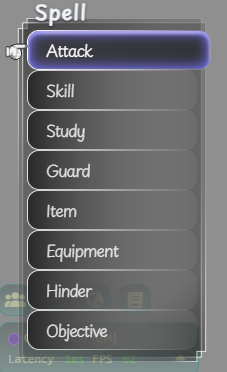
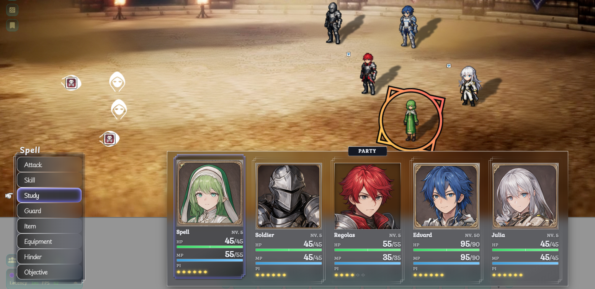

# Fabula JRPG UI

A custom JRPG-style combat interface for **Fabula Ultima** running on **Foundry Virtual Tabletop**.

The project aims to provide a more game-like combat experience inspired by classic and modern JRPGs, while keeping **Project FU** as the source of truth for Fabula Ultima's rules and action execution.

> **Status:** _Work in Progress_

## Overview

Fabula JRPG UI replaces parts of the standard Foundry interaction flow with a custom combat interface designed around the structure commonly found in JRPGs.

The current focus is combat rather than replacing the complete character sheet or Foundry's entire UI.

The main interaction flow is:

```text
COMMAND

 ├── ATTACK
 ├── SKILL
 ├── STUDY
 ├── EQUIPMENT
 ├── GUARD
 ├── ITEM
 ├── HINDER
 └── OBJECTIVE
```

Actions that require targets continue through a target-selection flow:

```text
COMMAND
 → ACTION
 → TARGET COUNT
 → TARGET SELECT
 → CONFIRM
 → EXECUTE
```

The UI is responsible for presenting and collecting player input. Project FU remains responsible for executing the underlying Fabula Ultima rules whenever possible.

## Screenshots

### Command Menu

The Command menu provides keyboard and mouse-driven access to the character's available combat actions.



### Full Combat UI

The current interface combines the Command menu with the Party HUD and character combat information.



## Features

### Combat Command Menu

- Attack
- Skill
- Study
- Equipment
- Guard
- Item
- Hinder
- Objective

### Action Menus

- Weapon-based Attack selection
- Skill selection
- Consumable Item selection
- Skill resource cost display
- Item IP cost display
- Keyboard navigation
- Mouse hover navigation
- Scrolling support
- Long action name marquee animation

### Party HUD

- Character portraits pulled directly from Project FU Actors
- Character name and level display
- HP and MP resource bars
- HP Crisis indicator
- IP point display
- Active combatant indication
- Dynamic character information updates
- Glass-panel visual design
- SVG-based ornamental frames

### Target Selection

- Party and enemy grouping
- Manual target selection
- Multiple target selection
- Configurable target count
- Target selection independent of ally/enemy restrictions
- Visual Canvas Token cursor
- Selected target highlighting
- Target group navigation
- Target list scrolling

### Confirmation

- Action confirmation menu
- Selected action display
- Selected target display
- Confirm / Cancel navigation
- Canvas target cursor cleanup after confirmation

### Audio Feedback

The combat interface includes local UI sound effects for interaction feedback.

Current sound events include:

- `navigate` — option navigation
- `swipe` — switching between target groups
- `confirm` — confirming an action or selecting a target
- `cancel` — returning to the previous menu or cancelling an action

Audio is handled locally by each client and does not broadcast UI interaction sounds to other players.

### Keyboard Navigation

The combat interface is designed to be playable primarily through keyboard navigation.

Current controls include:

- `Arrow Up / Down` — navigate options
- `Arrow Left / Right` — switch target groups
- `Enter` — confirm/select
- `Escape` — return to the previous menu
- `F` — focus the Command menu

Mouse interaction is also supported throughout the combat menus where applicable.

## Project FU Integration

This project does not attempt to recreate Fabula Ultima's rule system.

Instead, the UI integrates with Project FU's existing systems whenever possible.

For example:

- **Study** delegates execution to `ActionHandler.handleStudyAction()`
- **Equipment** delegates execution to `ActionHandler.equipment()`
- Actions use Project FU's existing item/action rolling system
- Selected targets are synchronized with Foundry's native targeting before execution
- Action resources and costs are read directly from Project FU item data

This keeps the custom interface separate from the underlying game rules.

## Architecture

The project currently follows a lightweight modular structure:

```text
fabula-jrpg-ui/

├── assets/
│   ├── audio/
│   │   ├── ui-navigate.ogg
│   │   ├── ui-swipe.ogg
│   │   ├── ui-confirm.ogg
│   │   └── ui-cancel.ogg
│   │
│   ├── cursor.png
│   ├── moldura.svg
│   ├── moldura-active.svg
│   ├── moldura-command.svg
│   │
│   └── screenshots/
│       ├── jrpg-ui-command-focus.png
│       └── jrpg-ui-full-view.png
│
├── scripts/
│   ├── main.js
│   │
│   └── ui/
│       ├── action-menu.js
│       ├── audio.js
│       ├── canvas-cursor.js
│       ├── character-card.js
│       ├── command-menu.js
│       ├── confirm-menu.js
│       ├── equipment-action.js
│       ├── execute-action.js
│       ├── guard-action.js
│       ├── hinder-action.js
│       ├── hud-cursor.js
│       ├── menu-utils.js
│       ├── objective-action.js
│       ├── study-action.js
│       ├── target-menu.js
│       └── target-select-menu.js
│
├── styles/
│   ├── action.css
│   ├── base.css
│   ├── command.css
│   ├── confirm.css
│   ├── party.css
│   ├── target.css
│   └── target-select.css
│
├── module.json
├── .gitignore
└── README.md
```

The project intentionally avoids unnecessary abstraction while the combat UI is still being developed.

## Design Principles

### UI First, Rules Second

The custom UI handles presentation, navigation, selection, and interaction.

Game rules should remain inside Project FU whenever an existing Project FU mechanism can perform the required operation.

### Modular Menus

Each major interaction is separated into its own module so that individual parts of the combat flow can be developed and refactored independently.

### Simple Architecture

The project favors straightforward code over premature abstraction.

The architecture may evolve as the UI becomes more complex, but complexity should be introduced only when it provides a clear benefit.

### JRPG-Inspired, Not JRPG-Restricted

The interface takes inspiration from classic and modern JRPG combat interfaces, particularly their focus on clear action selection, character status presentation, audiovisual feedback, and keyboard-driven navigation.

Visual consistency should not take priority over correct Fabula Ultima behavior.

### Visual Direction

The current interface uses a glass-panel aesthetic combined with ornamental fantasy framing and JRPG-inspired interaction patterns.

The visual language is inspired by games such as **Octopath Traveler II**, while remaining adapted to the needs of a tabletop RPG interface.

The goal is not to reproduce a specific game's interface, but to create a coherent JRPG-inspired combat HUD for Fabula Ultima.

## Roadmap

### Combat UI

- [x] Command menu
- [x] Attack menu
- [x] Skill menu
- [x] Item menu
- [x] Study
- [x] Equipment
- [x] Guard
- [x] Hinder
- [x] Objective
- [x] Target count selection
- [x] Target selection
- [x] Confirmation menu
- [x] Project FU action execution
- [x] Keyboard navigation
- [x] Mouse interaction
- [x] Escape-based menu navigation
- [x] Target group navigation
- [x] Canvas Token cursor
- [x] UI sound effects

### Party HUD

- [x] Party HUD
- [x] Character portrait integration
- [x] Character name and level display
- [x] HP/MP resource display
- [x] IP point display
- [x] HP Crisis indicator
- [x] Dynamic active character display
- [x] Focused Command menu state

### Visual Design

- [x] Party HUD redesign
- [x] Command menu redesign
- [x] Glass-panel UI
- [x] SVG ornamental frames
- [x] Character portrait integration
- [x] HP/MP resource display
- [x] IP point display
- [x] HP Crisis indicator
- [x] Focused Command menu state
- [x] Dynamic active character display

### Future Work

- [ ] Add customizable and responsive UI scaling
- [ ] Add target group swipe animation
- [ ] Add status effect indicators to Party HUD
- [ ] Add optional Zero Power visual indicator
- [ ] Refine turn-state visual feedback
- [ ] Refactor and audit UI architecture

## Development

This project is currently being developed as a Foundry VTT module.

The module should be installed inside the Foundry `Data/modules/` directory during development.

After making changes to the source files, reload Foundry to test the updated module.

During development, the module may also be tested in multiplayer sessions using external networking tools such as ngrok.

## Contributing

The project is currently under active development and its architecture may change significantly.

At this stage, development is primarily focused on establishing the combat UI and its integration with Project FU before expanding into broader functionality.

## License

License information will be added once the project's distribution and licensing model has been decided.

## Acknowledgements

- **Fabula Ultima** — tabletop roleplaying game by Need Games
- **Project FU** — Foundry VTT system implementation for Fabula Ultima
- **Foundry Virtual Tabletop** — virtual tabletop platform
